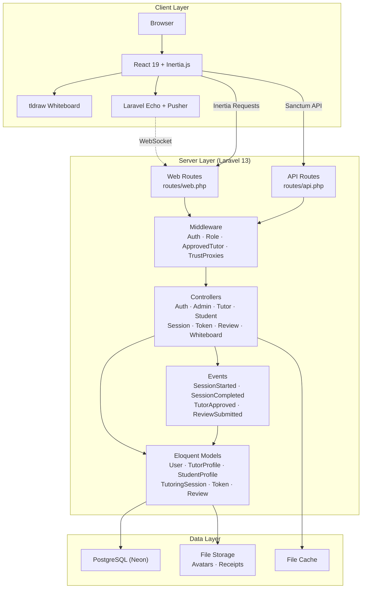
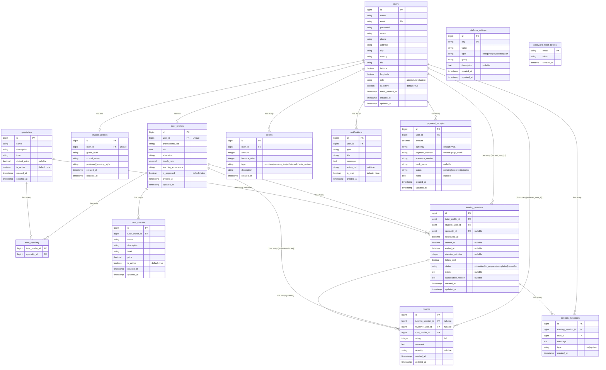
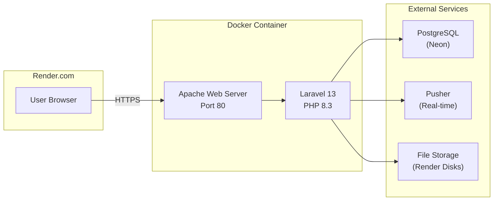

# TutoriaApp — Architecture Document

## 1. Overview

**TutoriaApp** is an educational platform that connects students with tutors for online tutoring sessions. The platform features tutor profiles with specialties, a token-based payment system, an interactive whiteboard powered by tldraw, session booking and management, a review and rating system, and a comprehensive admin dashboard for platform management.

| Aspect         | Details                                      |
|----------------|----------------------------------------------|
| **Project**    | TutoriaApp                                   |
| **Type**       | Educational / Marketplace                     |
| **Backend**    | Laravel 13 + PHP 8.3                         |
| **Frontend**   | React 19 + Inertia.js + TypeScript           |
| **Database**   | PostgreSQL (hosted on Neon)                  |
| **Real-time**  | Laravel Echo + Pusher                        |
| **Whiteboard** | tldraw v4                                    |
| **Hosting**    | Render.com (Docker)                          |
| **License**    | MIT                                          |

---

## 2. Tech Stack

### Backend

| Technology          | Version | Purpose                                  |
|---------------------|---------|------------------------------------------|
| Laravel             | 13.x    | Application framework                    |
| PHP                 | 8.3     | Server-side language                      |
| PostgreSQL          | —       | Relational database (Neon hosted)        |
| Laravel Sanctum     | 4.x     | API token authentication                 |
| Inertia.js Laravel  | 3.x     | Server-side adapter for React SPA        |
| Ziggy               | 2.x     | Named route generation for JS            |
| Doctrine DBAL       | 4.x     | Database abstraction layer (migrations)  |

### Frontend

| Technology          | Version | Purpose                                  |
|---------------------|---------|------------------------------------------|
| React               | 19.x    | UI library                                |
| Inertia.js React    | 3.x     | SPA routing without client-side router   |
| TypeScript          | 6.x     | Type safety                              |
| Tailwind CSS        | 4.x     | Utility-first CSS framework              |
| tldraw              | 4.x     | Interactive whiteboard                    |
| Laravel Echo        | 2.x     | Real-time broadcasting client            |
| Pusher-js           | 8.x     | WebSocket client                         |
| Lucide React        | 1.x     | Icon library                             |
| Vite                | 8.x     | Frontend build tool                      |

### Infrastructure

| Technology          | Purpose                                  |
|---------------------|------------------------------------------|
| Docker              | Containerized deployment                 |
| Apache (PHP 8.3)    | Web server inside Docker container       |
| Render.com          | Cloud hosting platform                   |
| Neon                | Serverless PostgreSQL provider           |

---

## 3. Architecture Diagram



---

## 4. Directory Structure

```
tutoria-app/
├── app/
│   ├── Http/
│   │   ├── Controllers/
│   │   │   ├── AuthController.php
│   │   │   ├── Auth/
│   │   │   │   └── ForgotPasswordController.php
│   │   │   ├── AdminController.php
│   │   │   ├── Controller.php
│   │   │   ├── ForgotPasswordController.php
│   │   │   ├── HomeController.php
│   │   │   ├── NotificationController.php
│   │   │   ├── ProfileController.php
│   │   │   ├── ReviewController.php
│   │   │   ├── SearchController.php
│   │   │   ├── SessionController.php
│   │   │   ├── StudentController.php
│   │   │   ├── TokenController.php
│   │   │   ├── TutorController.php
│   │   │   └── WhiteboardController.php
│   │   └── Middleware/
│   │       ├── ApprovedTutorMiddleware.php
│   │       ├── HandleInertiaRequests.php
│   │       ├── RoleMiddleware.php
│   │       └── TrustProxies.php
│   ├── Models/
│   │   ├── Notification.php
│   │   ├── PaymentReceipt.php
│   │   ├── PlatformSetting.php
│   │   ├── Review.php
│   │   ├── SessionMessage.php
│   │   ├── Specialty.php
│   │   ├── StudentProfile.php
│   │   ├── Token.php
│   │   ├── TutorCourse.php
│   │   ├── TutorProfile.php
│   │   ├── TutoringSession.php
│   │   └── User.php
│   ├── Providers/
│   │   └── AppServiceProvider.php
│   └── Events/
│       ├── ReviewSubmitted.php
│       ├── SessionCompleted.php
│       ├── SessionStarted.php
│       └── TutorApproved.php
├── database/
│   ├── migrations/
│   │   ├── 0001_01_01_000000_create_users_table.php
│   │   ├── 0001_01_01_000001_create_cache_table.php
│   │   ├── 0001_01_01_000002_create_jobs_table.php
│   │   ├── 2026_04_08_182916_add_role_field_to_users_table.php
│   │   ├── 2026_04_08_182916_create_student_profiles_table.php
│   │   ├── 2026_04_08_182916_create_tutor_profiles_table.php
│   │   ├── 2026_04_08_182917_create_tutor_courses_table.php
│   │   ├── 2026_04_08_182917_create_tokens_table.php
│   │   ├── 2026_04_08_182917_create_tutor_specialty_table.php
│   │   ├── 2026_04_08_182917_create_tutoring_sessions_table.php
│   │   ├── 2026_04_08_182918_create_reviews_table.php
│   │   ├── 2026_04_08_182918_create_notifications_table.php
│   │   ├── 2026_04_08_182936_create_personal_access_tokens_table.php
│   │   ├── 2026_04_20_000001_create_session_messages_table.php
│   │   ├── 2026_04_20_100000_create_payment_receipts_table.php
│   │   ├── 2026_04_22_000001_create_conversations_table.php
│   │   ├── 2026_04_22_000001_create_messages_table.php
│   │   ├── 2026_04_22_000002_create_messages_table.php (withdrawals)
│   │   ├── 2026_04_22_000003_create_withdrawals_table.php
│   │   ├── 2026_04_22_000004_create_platform_settings_table.php
│   │   ├── 2026_04_22_000005_add_withdrawal_to_tokens_enum.php
│   │   ├── 2026_04_22_000006_create_email_verification_tokens_table.php
│   │   ├── 2026_04_23_000001_create_thesis_reviews_table.php
│   │   ├── 2026_04_23_000002_create_thesis_feedback_table.php
│   │   ├── 2026_04_23_000003_add_thesis_review_to_tokens_enum.php
│   │   ├── 2026_04_23_100000_create_token_packages_table.php
│   │   ├── 2026_04_23_100000_add_pricing_to_specialties_table.php
│   │   ├── 2026_04_23_100001_create_token_packages_table.php
│   │   ├── 2026_04_23_100002_add_specialty_id_to_tutoring_sessions_table.php
│   │   ├── 2026_04_24_000000_create_tutor_availabilities_table.php
│   │   ├── 2026_04_24_000001_create_password_reset_tokens_table.php
│   │   ├── 2026_04_24_100000_add_severity_to_reviews_table.php
│   │   └── 2026_04_24_200000_make_reviewer_user_id_nullable.php
│   └── seeders/
│       ├── AdminUserSeeder.php
│       ├── DatabaseSeeder.php
│       ├── SpecialtySeeder.php
│       └── TutoriaDataSeeder.php
├── resources/
│   ├── js/
│   │   ├── app.tsx
│   │   ├── bootstrap.js
│   │   ├── route.ts
│   │   ├── vite-env.d.ts
│   │   ├── types/
│   │   │   └── index.d.ts
│   │   ├── Components/
│   │   │   ├── AdminLayout.tsx
│   │   │   ├── Avatar.tsx
│   │   │   ├── DashboardLayout.tsx
│   │   │   ├── DefaultLayout.tsx
│   │   │   ├── ErrorBoundary.tsx
│   │   │   ├── FlashMessage.tsx
│   │   │   └── StarRating.tsx
│   │   ├── Hooks/
│   │   │   └── useCountdown.ts
│   │   ├── Layouts/
│   │   │   ├── AdminLayout.tsx
│   │   │   ├── DashboardLayout.tsx
│   │   │   └── DefaultLayout.tsx
│   │   └── Pages/
│   │       ├── About.tsx
│   │       ├── Home.tsx
│   │       ├── Pricing.tsx
│   │       ├── Auth/
│   │       │   ├── Login.tsx
│   │       │   └── Register.tsx
│   │       ├── Admin/
│   │       │   ├── AllStudents.tsx
│   │       │   ├── AllTutors.tsx
│   │       │   ├── Dashboard.tsx
│   │       │   ├── ManageSessions.tsx
│   │       │   ├── ManageSpecialties.tsx
│   │       │   ├── ManageStudents.tsx
│   │       │   ├── ManageTutors.tsx
│   │       │   ├── PaymentReceipts.tsx
│   │       │   ├── PendingTutors.tsx
│   │       │   ├── Reviews.tsx
│   │       │   ├── Sessions.tsx
│   │       │   ├── Specialties.tsx
│   │       │   └── Warnings.tsx
│   │       ├── Notifications/
│   │       │   └── Index.tsx
│   │       ├── Reviews/
│   │       │   └── Index.tsx
│   │       ├── Search/
│   │       │   ├── FindTutors.tsx
│   │       │   └── Results.tsx
│   │       ├── Sessions/
│   │       │   ├── Index.tsx
│   │       │   └── Show.tsx
│   │       ├── Student/
│   │       │   ├── Dashboard.tsx
│   │       │   ├── FindTutors.tsx
│   │       │   ├── Profile.tsx
│   │       │   └── Sessions.tsx
│   │       ├── Tokens/
│   │       │   └── Index.tsx
│   │       ├── Tutor/
│   │       │   ├── Courses.tsx
│   │       │   ├── Dashboard.tsx
│   │       │   ├── Earnings.tsx
│   │       │   ├── Profile.tsx
│   │       │   ├── PublicProfile.tsx
│   │       │   ├── Sessions.tsx
│   │       │   ├── Show.tsx
│   │       │   ├── Students.tsx
│   │       │   └── Students/
│   │       │       └── Show.tsx
│   │       └── Whiteboard/
│   │           ├── Room.tsx
│   │           └── Show.tsx
│   └── views/
│       ├── app.blade.php
│       └── welcome.blade.php
├── routes/
│   ├── api.php
│   ├── console.php
│   └── web.php
├── config/
│   ├── app.php
│   ├── auth.php
│   ├── broadcasting.php
│   ├── cache.php
│   ├── database.php
│   ├── filesystems.php
│   ├── logging.php
│   ├── mail.php
│   ├── queue.php
│   ├── sanctum.php
│   ├── services.php
│   └── session.php
├── Dockerfile
├── entrypoint.sh
├── composer.json
├── package.json
├── vite.config.ts
├── tsconfig.json
└── .env.example
```

---

## 5. Authentication & Authorization

### Authentication

TutoriaApp uses a **custom `AuthController`** (not Laravel Fortify) for handling authentication flows:

| Flow            | Method        | Route                  | Description                          |
|-----------------|---------------|------------------------|--------------------------------------|
| Show Login      | GET           | `/login`               | Display login page                   |
| Login           | POST          | `/login`               | Authenticate user (rate-limited 5/min) |
| Show Register   | GET           | `/register`            | Display registration page            |
| Register        | POST          | `/register`            | Create new account (rate-limited 5/min) |
| Logout          | POST          | `/logout`              | Invalidate session                   |
| Forgot Password | GET           | `/forgot-password`     | Display forgot password form         |
| Send Reset Link | POST          | `/forgot-password`     | Send password reset email (rate-limited 3/min) |
| Show Reset Form | GET           | `/reset-password/{token}` | Display reset form                |
| Reset Password  | POST          | `/reset-password`      | Update password                      |

- Passwords are hashed with Laravel's default **bcrypt** driver via the `hashed` cast.
- Session management uses Laravel's built-in **session driver** (file-based by default).
- API routes are protected via **Laravel Sanctum** token authentication (`auth:sanctum` middleware).

### Role-Based Authorization

Three user roles are defined on the `users` table via a `role` column:

| Role      | Access Level                                         |
|-----------|------------------------------------------------------|
| `admin`   | Full platform management (users, sessions, reviews, specialties, tokens) |
| `tutor`   | Own profile, courses, specialties, sessions, students, earnings |
| `student` | Own profile, session booking, token management, tutor search |

### Middleware

| Middleware                | Alias           | Purpose                                               |
|--------------------------|-----------------|-------------------------------------------------------|
| `RoleMiddleware`         | `role`          | Restricts access by user role (e.g., `role:admin`)   |
| `ApprovedTutorMiddleware`| `approved.tutor`| Ensures tutor profile is approved before access       |
| `TrustProxies`           | —               | Trusts X-Forwarded-* headers from load balancer/HTTPS |
| `HandleInertiaRequests`  | —               | Shares auth user and flash data with Inertia.js       |

### Route Middleware Groups

```php
// Public (guest only, rate-limited)
Route::middleware(['guest', 'throttle:5,1'])       // Auth pages
Route::middleware(['guest', 'throttle:3,1'])       // Password reset

// Student-only routes
Route::middleware(['auth', 'role:student'])

// Tutor routes (must be approved)
Route::middleware(['auth', 'role:tutor', 'approved.tutor'])

// Admin routes
Route::middleware(['auth', 'role:admin'])

// Shared authenticated routes
Route::middleware(['auth'])
```

---

## 6. Key Features

### 6.1 Tutor Management
- **Tutor Profiles**: Bio, specialties, hourly rate, availability schedule
- **Courses**: Tutors can create and manage their course offerings
- **Specialties**: Tutors select from platform-managed specialty list (M:N via pivot table)
- **Approval Workflow**: New tutors register and must be approved by admin before accessing tutor features
- **Earnings Dashboard**: Track income from completed sessions

### 6.2 Student Features
- **Tutor Search & Discovery**: Search tutors by specialty, name, location with filtering
- **Session Booking**: Book tutoring sessions with available tutors
- **Token Wallet**: Token-based payment system with balance tracking
- **Top-up Requests**: Students can request token top-ups via payment receipts

### 6.3 Session System
- **Booking Flow**: Student books session → tokens deducted → session scheduled
- **Session States**: `scheduled`, `in_progress`, `completed`, `cancelled`
- **Start/End Controls**: Both tutor and student can start/end sessions
- **Cancellation**: Sessions can be cancelled with token refund
- **Interactive Whiteboard**: tldraw v4 integration for collaborative drawing/writing during sessions
- **Session Chat**: Real-time text chat within session context (stored as `session_messages`)

### 6.4 Whiteboard (tldraw v4)
- Full interactive whiteboard experience using [tldraw](https://tldraw.dev/)
- Real-time synchronization via Laravel Echo + Pusher WebSockets
- Chat functionality alongside the whiteboard canvas
- Data persistence through server-side storage

### 6.5 Token Payment System
- Tokens serve as the platform currency
- Students purchase tokens via payment receipts (Pago Móvil / bank transfer)
- Admin approves/rejects payment receipts
- Tokens are deducted when booking sessions
- Token transaction types: `purchase`, `session_fee`, `withdrawal`, `thesis_review`

### 6.6 Review & Rating System
- Students can rate tutors (1–5 stars) and leave written reviews after sessions
- Admin can manage and moderate reviews (including deletion)
- Severity levels on reviews for admin prioritization

### 6.7 Admin Dashboard
- **User Management**: View/manage all tutors and students, activate/deactivate accounts
- **Tutor Approval**: Approve, reject, suspend, or activate tutor applications
- **Session Oversight**: View all platform sessions
- **Specialty Management**: CRUD operations on platform specialties
- **Token Administration**: Grant tokens to users, manage payment receipts
- **Review Moderation**: View and delete inappropriate reviews
- **Warning System**: Issue warnings to users
- **Platform Settings**: Configurable platform-wide settings

### 6.8 Notifications
- In-app notification system for all users
- Mark individual notifications as read or bulk mark all as read
- Unread count available via API endpoint

### 6.9 Password Recovery
- Email-based password reset flow with signed tokens
- Rate-limited to prevent abuse (3 requests/minute)

---

## 7. Database Schema



### Key Relationships Summary

| Relationship                          | Type      | Foreign Key                        |
|---------------------------------------|-----------|-------------------------------------|
| User → TutorProfile                   | 1:1       | `tutor_profiles.user_id`           |
| User → StudentProfile                 | 1:1       | `student_profiles.user_id`         |
| User → Token                          | 1:N       | `tokens.user_id`                   |
| User → Notification                   | 1:N       | `notifications.user_id`            |
| User → Review (as reviewer)           | 1:N       | `reviews.reviewer_user_id`         |
| User → TutoringSession (as student)   | 1:N       | `tutoring_sessions.student_user_id`|
| TutorProfile → TutoringSession        | 1:N       | `tutoring_sessions.tutor_profile_id`|
| TutorProfile ↔ Specialty              | M:N       | `tutor_specialty` (pivot)          |
| TutorProfile → TutorCourse            | 1:N       | `tutor_courses.tutor_profile_id`   |
| TutoringSession → SessionMessage      | 1:N       | `session_messages.tutoring_session_id` |
| TutoringSession → Review              | 1:N       | `reviews.tutoring_session_id`      |
| User → PaymentReceipt                 | 1:N       | `payment_receipts.user_id`         |

---

## 8. API Endpoints

All API routes are protected by `auth:sanctum` middleware.

| Method | Endpoint                   | Controller Method       | Description              |
|--------|----------------------------|-------------------------|--------------------------|
| GET    | `/api/user`                | Closure                 | Get authenticated user   |
| GET    | `/api/tokens/balance`      | `TokenController@getBalance` | Get user token balance |
| GET    | `/api/notifications/unread`| `NotificationController@unreadCount` | Get unread notification count |
| GET    | `/api/specialties`         | `SearchController@getSpecialties` | List all specialties |

### Whiteboard API Routes (Authenticated, in web.php)

These are additional REST endpoints for whiteboard data sync, prefixed under `/api/whiteboard`:

| Method | Endpoint                      | Controller Method            | Description                    |
|--------|-------------------------------|------------------------------|--------------------------------|
| GET    | `/api/whiteboard/{sessionId}` | `WhiteboardController@getData`| Get whiteboard state            |
| POST   | `/api/whiteboard/{sessionId}` | `WhiteboardController@update`| Save whiteboard state           |
| GET    | `/api/whiteboard/{sessionId}/chat` | `WhiteboardController@getChat`| Get session chat messages    |
| POST   | `/api/whiteboard/{sessionId}/chat` | `WhiteboardController@sendChat`| Send a chat message        |

### Web Routes Summary

| Method   | Route Pattern                                    | Auth | Role     | Description                     |
|----------|--------------------------------------------------|------|----------|---------------------------------|
| GET      | `/`                                              | No   | —        | Home page                       |
| GET      | `/about`                                         | No   | —        | About page                      |
| GET      | `/pricing`                                       | No   | —        | Pricing page                    |
| GET      | `/search`                                        | No   | —        | Search tutors                   |
| GET      | `/tutors`                                        | No   | —        | List tutors                     |
| GET      | `/tutors/{id}`                                   | No   | —        | View public tutor profile       |
| GET/POST | `/login`, `/register`                            | Guest| —        | Authentication                  |
| GET/POST | `/forgot-password`, `/reset-password/{token}`    | Guest| —        | Password recovery               |
| POST     | `/logout`                                        | Yes  | —        | Logout                          |
| POST/PUT | `/profile/avatar`, `/profile/password`           | Yes  | —        | Profile management (shared)     |
| *        | `/student/*`                                     | Yes  | student  | Student dashboard & features    |
| *        | `/tutor/*`                                       | Yes  | tutor+   | Tutor dashboard & features      |
| *        | `/admin/*`                                       | Yes  | admin    | Admin management               |
| *        | `/sessions/*`                                    | Yes  | —        | Session management (shared)     |
| POST     | `/reviews`                                       | Yes  | —        | Submit review                   |
| *        | `/notifications/*`                               | Yes  | —        | Notification management         |
| GET      | `/whiteboard/{sessionId}`                        | Yes  | —        | Whiteboard page                 |

> **tutor+** = Requires both `role:tutor` and `approved.tutor` middleware.

---

## 9. Deployment

### Docker-Based Deployment on Render.com

The application is deployed as a single Docker container on Render.com with the following architecture:



### Dockerfile Summary

- **Base image**: `php:8.3-apache`
- **PHP extensions**: GD (image processing), PDO PostgreSQL, Zip
- **Node.js**: v22 (installed for frontend build)
- **Build process**: Composer install → npm install → Vite build
- **Document root**: `/var/www/html/public`
- **Exposed port**: 80

### Entrypoint Script (`entrypoint.sh`)

The entrypoint handles container initialization on each deploy:

1. **Generate application key** (`php artisan key:generate`)
2. **Fix APP_URL** to match `RENDER_EXTERNAL_URL`
3. **Fix DB_HOST**: Strips `-pooler` suffix for direct Neon connection (required for migrations)
4. **Run migrations** (`php artisan migrate --force`)
5. **Run seeders** (only on first deploy, tracked via `storage/.seeded` flag)
6. **Cache optimization** (config, routes, views)
7. **Start Apache** (`apache2-foreground`)

### Environment Variables

| Variable              | Required | Description                              |
|-----------------------|----------|------------------------------------------|
| `APP_NAME`            | Yes      | Application name (default: TutoriaApp)  |
| `APP_ENV`             | Yes      | Environment (local/staging/production)  |
| `APP_KEY`             | Yes      | Encryption key (auto-generated)         |
| `APP_DEBUG`           | No       | Debug mode (false in production)        |
| `APP_URL`             | Yes      | Application URL (auto-set from Render)  |
| `DB_CONNECTION`       | Yes      | Database driver (`pgsql`)               |
| `DB_HOST`             | Yes      | PostgreSQL host (Neon)                  |
| `DB_PORT`             | Yes      | PostgreSQL port (5432)                  |
| `DB_DATABASE`         | Yes      | Database name                           |
| `DB_USERNAME`         | Yes      | Database user                           |
| `DB_PASSWORD`         | Yes      | Database password                       |
| `BROADCAST_DRIVER`    | No       | Broadcast driver (`log`/`pusher`)       |
| `CACHE_DRIVER`        | No       | Cache driver (`file`)                   |
| `FILESYSTEM_DISK`     | No       | Storage disk (`public`)                 |
| `QUEUE_CONNECTION`    | No       | Queue driver (`sync`)                   |
| `SESSION_DRIVER`      | No       | Session driver (`file`)                 |
| `SANCTUM_STATEFUL_DOMAINS` | Yes  | Sanctum domains                        |
| `PUSHER_APP_ID`       | No       | Pusher app ID (for real-time)           |
| `PUSHER_APP_KEY`      | No       | Pusher app key                          |
| `PUSHER_APP_SECRET`   | No       | Pusher app secret                       |
| `PUSHER_APP_CLUSTER`  | No       | Pusher cluster (mt1)                    |
| `JITSI_DOMAIN`        | No       | Jitsi Meet domain for video calls       |
| `PAYMENT_BANK_NAME`   | No       | Bank name for payment receipts          |
| `PAYMENT_PHONE`       | No       | Phone for payment receipts              |
| `PAYMENT_CI_RIF`      | No       | CI/RIF for payment receipts             |
| `RENDER_EXTERNAL_URL` | No       | Auto-set by Render.com                  |

---

## 10. Security Considerations

### Authentication Security
- **Password Hashing**: All passwords are hashed using bcrypt via Laravel's `hashed` cast
- **Session Management**: Secure session-based authentication for web routes
- **API Authentication**: Laravel Sanctum provides token-based API authentication with `auth:sanctum` middleware
- **Password Reset Tokens**: Signed, time-limited tokens for password recovery

### Input Validation & Protection
- **CSRF Protection**: Laravel's built-in CSRF middleware protects all state-changing requests
- **Rate Limiting**: Auth routes are rate-limited (`throttle:5,1` for login/register, `throttle:3,1` for password reset)
- **Input Validation**: Server-side validation on all form submissions and API requests
- **Mass Assignment Protection**: Models define explicit `$fillable` arrays

### Authorization
- **Role-Based Access Control**: `RoleMiddleware` ensures users can only access routes for their assigned role
- **Tutor Approval Gate**: `ApprovedTutorMiddleware` blocks unapproved tutors from accessing tutor features
- **Resource Authorization**: Controllers verify ownership before allowing modifications (e.g., students can only cancel their own sessions)

### Infrastructure Security
- **TrustProxies**: Configured to properly handle `X-Forwarded-*` headers from Render.com's load balancer
- **HTTPS**: Enforced via Render.com's automatic SSL/TLS termination
- **Environment Isolation**: Sensitive credentials stored in environment variables, never committed to source
- **APP_KEY**: Auto-generated encryption key for secure data handling

### Data Protection
- **Hidden Attributes**: Password and remember_token are hidden from JSON serialization
- **Avatar Access**: Avatar attribute accessor ensures consistent URL generation via Storage facade
- **Database**: PostgreSQL provides data integrity constraints and the Neon serverless platform handles automated backups
